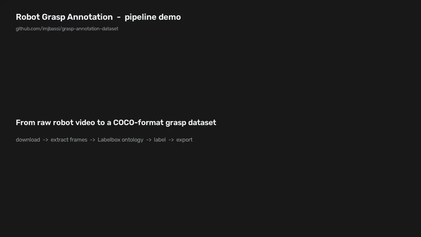

# Robot Manipulation Grasp Annotation Dataset

A small, self-contained **data-ops pipeline** for building a labelled robot
manipulation dataset with [Labelbox](https://labelbox.com)'s free tier. It
takes publicly available robot-arm video, samples it into frames, provisions a
Labelbox project with a purpose-built ontology, uploads the frames for
annotation, and exports the completed labels as **COCO-format JSON** ready for
model training.

The whole thing runs on a laptop with **no robot, no GPU, and no simulator** —
only free tools and free datasets.

```
raw robot video  ──►  frames  ──►  Labelbox project + ontology  ──►  human labels  ──►  COCO JSON
   (download)         (extract)        (create + upload)              (annotate)         (export)
```

## Demo

A 15-second walkthrough — the raw robot-arm clip, the three annotation types
overlaid (`grasp_event` box, `object_contact` keypoint, `failure_mode` label),
and the matching COCO JSON. Rendered from the same geometry the exporter uses;
regenerate it with `make video`.



▶️ Higher-quality H.264 version: [`assets/demo_walkthrough.mp4`](assets/demo_walkthrough.mp4)

---

## What the annotations capture

Robot grasping is where manipulation most often fails, so the schema is built
around *why a grasp succeeds or fails*. Every frame can carry three kinds of
annotation:

| Annotation      | Labelbox tool  | COCO representation                 | Meaning |
| --------------- | -------------- | ----------------------------------- | ------- |
| `grasp_event`   | Bounding box   | object annotation with `bbox`       | Tight box around the gripper–object contact region at the moment a grasp is attempted. |
| `object_contact`| Keypoint (point) | object annotation with `keypoints` | Single point where a fingertip first touches the object surface. |
| `failure_mode`  | Radio classification | `failure_mode` field on the image record | Per-frame outcome — exactly one of the options below. |

**`failure_mode` options:** `drop`, `miss`, `collision`, `timeout`, `success`.

- **drop** — object was grasped but slipped out of the gripper.
- **miss** — gripper closed without ever securing the object.
- **collision** — arm/gripper struck the object or environment unintentionally.
- **timeout** — attempt exceeded the time budget without resolution.
- **success** — object grasped and held (the non-failure control class).

The schema lives in one place — [`src/grasp_annot/ontology.py`](src/grasp_annot/ontology.py)
— and is imported by both the project-creation and export steps so the two ends
can never drift apart.

---

## What the exported dataset represents

`data/exports/grasp_coco.json` is a standard **COCO** file:

- `images[]` — one record per annotated frame. `file_name` is the frame's
  Labelbox `global_key` (which encodes the source clip and timestep, e.g.
  `demo_clip__f000009.png`), plus the image-level `failure_mode` label.
- `annotations[]` — the `grasp_event` boxes (category `1`) and `object_contact`
  keypoints (category `2`), each linked to its image via `image_id`.
- `categories[]` — the two object categories; `object_contact` declares a single
  `contact_point` keypoint.

It loads directly with `pycocotools` or any COCO-aware training pipeline. The
`failure_mode` field turns the same file into a frame-level classification
dataset as well.

---

## Repository layout

```
grasp-annotation-dataset/
├── README.md
├── requirements.txt
├── Makefile                     # one-liners for every pipeline step
├── .env.example                 # copy to .env, add your API key
├── config/
│   └── schema.md                # human-readable annotator guide
├── scripts/
│   ├── download_dataset.sh      # 1. fetch free robot-arm video
│   ├── extract_frames.py        # 2. video/sequence -> frames
│   └── make_demo_clip.py        # optional: synthetic clip, no download
├── src/grasp_annot/
│   ├── config.py                # env-driven settings + paths
│   ├── ontology.py              # the annotation schema (single source of truth)
│   ├── create_project.py        # 3. provision Labelbox project + ontology
│   ├── upload_data.py           # 4. upload frames + batch for labelling
│   └── export_coco.py           # 5. export labels -> COCO JSON
├── tests/
│   └── test_coco_convert.py     # offline unit tests (no account needed)
└── data/                        # raw/, frames/, exports/ (git-ignored)
```

---

## The dataset

**Primary source — [BridgeData V2](https://rail.eecs.berkeley.edu/datasets/bridge_release/)**
(UC Berkeley RAIL Lab). 60,000+ teleoperated manipulation trajectories (pick,
place, push, grasp) from real WidowX robot arms, released free for research and
distributed as plain RGB image sequences. Grab a sample:

```bash
bash scripts/download_dataset.sh bridge      # -> data/raw/bridge/
```

**Alternative — [Open X-Embodiment `jaco_play`](https://robotics-transformer-x.github.io/)**
(Kinova Jaco arm, tabletop pick-and-place), hosted on a public Google Cloud
bucket. Needs `gsutil`:

```bash
bash scripts/download_dataset.sh jaco        # -> data/raw/jaco_play/
```

> The full archives are large. The download script pulls a single small shard so
> the pipeline is demonstrable on a laptop; see each project page for the
> complete file list. `extract_frames.py` works on either video files or image
> sequences, so any robot-arm clips dropped into `data/raw/` will work.

**No download at all?** Generate a synthetic gripper-and-block clip:

```bash
python scripts/make_demo_clip.py             # -> data/raw/demo_clip/
```

**Want to see it end-to-end without an account?** Render an MP4 walkthrough
that shows the raw clip, all three annotation types overlaid, and the matching
COCO JSON — generated from the same geometry the real exporter uses:

```bash
make video                                   # -> data/exports/demo_walkthrough.mp4
```

---

## Setup

### 1. Install

```bash
python -m venv .venv && source .venv/bin/activate
pip install -r requirements.txt
```

### 2. Get a free Labelbox API key

1. Sign up at [app.labelbox.com](https://app.labelbox.com/) (free tier).
2. Go to **Account → API keys → New API key** and copy it.
3. Provide it to the scripts:

```bash
cp .env.example .env
# edit .env and paste your key into LABELBOX_API_KEY=
```

The key is read from the environment (via `.env`); it is never hard-coded and
`.env` is git-ignored.

---

## Running the pipeline

Each step is a `make` target (or run the underlying command directly).

| Step | Command | What it does |
| ---- | ------- | ------------ |
| 1. Download | `make download` | Fetch the BridgeData V2 sample into `data/raw/`. |
| 2. Extract  | `make frames`   | Sample frames into `data/frames/` (`--every 10` by default). |
| 3. Create   | `make project`  | Create the Labelbox project + ontology from the schema. |
| 4. Upload   | `make upload`   | Register frames as data rows and batch them for labelling. |
| 5. Annotate | *(in the app)*  | Label frames at `app.labelbox.com` using the ontology. |
| 6. Export   | `make export`   | Pull completed labels and write `data/exports/grasp_coco.json`. |

Direct invocations, with options:

```bash
bash scripts/download_dataset.sh bridge
python scripts/extract_frames.py --every 10 --max 500
python -m grasp_annot.create_project
python -m grasp_annot.upload_data --limit 100
python -m grasp_annot.export_coco --out data/exports/grasp_coco.json
```

### End-to-end with zero downloads

```bash
make demo                                     # synthetic clip
python scripts/extract_frames.py --every 3
make project && make upload
# ... label a few frames in the Labelbox app ...
make export
```

---

## Tests

Offline unit tests exercise the COCO converter against a synthetic Labelbox
export record — no account or network required:

```bash
make test          # or: PYTHONPATH=src pytest -q
```

CI runs the same tests on every push (`.github/workflows/ci.yml`).

---

## Notes & limitations

- Frames are uploaded as **images**, one data row per frame — the simplest thing
  that stays comfortably inside the Labelbox free tier and maps cleanly onto
  per-frame COCO annotations.
- The exporter tolerates both the newer streaming `project.export()` and the
  older `project.export_v2()` SDK APIs.
- `create_project` reuses an existing project/ontology of the same name instead
  of duplicating, so re-running is safe.

## License

MIT — see [LICENSE](LICENSE). Dataset content is governed by the respective
dataset licenses (BridgeData V2 / Open X-Embodiment).
